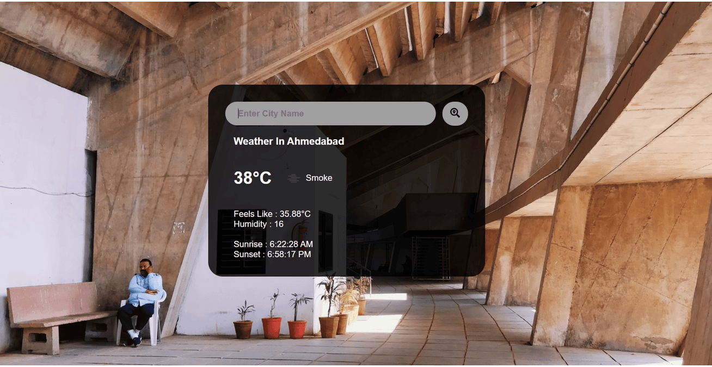

### City Weather App

#### Using Javascript, HTML & CSS

---

##### [Live Demo](https://dhruvilmaniar.github.io/weather_js/)

---

-   Fetches current weather data from [Openweathermap api](https://openweathermap.org/current) and shows it on the UI.

-   The background Image is fetched from [Unsplash](https://unsplash.com/developers) based on the city name.

#### Preview:

This is a very simple javascript project to test my theoritical understanding of core concepts like how Fetch works under the hood, Promises and the Micro-task queue - Event loop.
